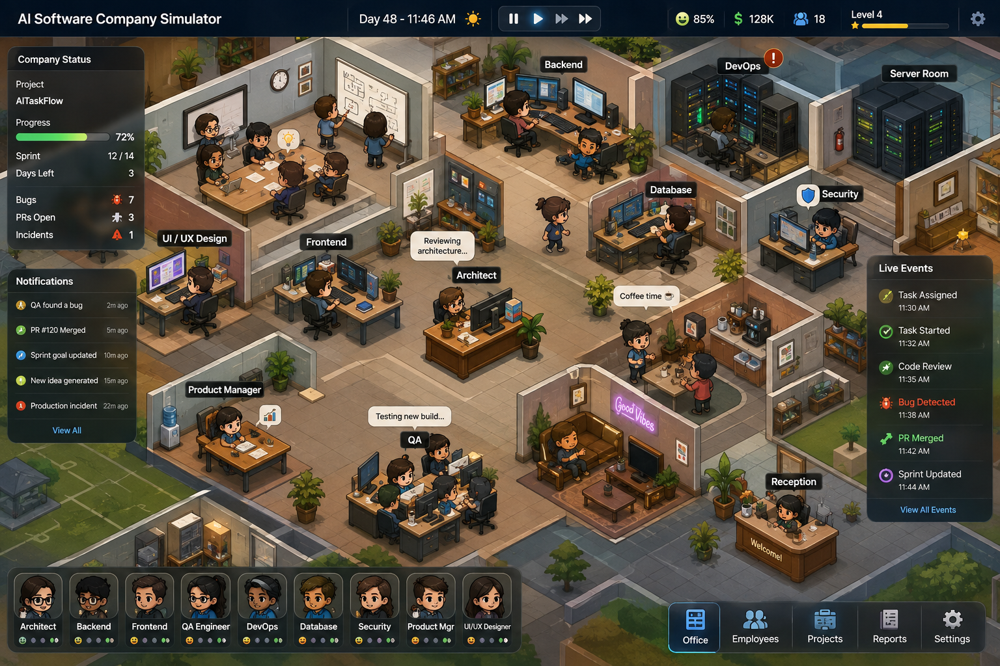

# AgentStack

A local-first desktop control panel for [Claude Agent SDK](https://github.com/anthropics/claude-agent-sdk) sessions. Pick a project, pick a subagent, and work — no terminal required.

AgentStack renders each project as an **office floor**: subagents sit at animated desks (icons, colors, live status), and clicking one opens a full chat panel wired straight into a live Claude Agent SDK session for that `(project, agent)` pair.

It's built to look and feel like a management simulator — the concept it's chasing:



Under the hood it's a real orchestration app, not a game — the desks, departments, and "employees" are just a friendlier skin over live Claude Agent SDK sessions, permissions, and tool calls.

---

## What it actually is

The app is an **Electron** application (main + preload + renderer), not a browser/CLI tool — everything runs locally on your machine with no server to start and no port to open.

```
npm run dev   (or the packaged .app)
   │
   ├─► Electron main process holds the Claude Agent SDK sessions,
   │   the local SQLite database, and filesystem access
   ├─► preload exposes a narrow, typed `window.agentstack` API
   └─► React renderer draws the office floor + chat UI and talks
       to the main process only through that API (IPC, no network)
```

Nothing here talks to Claude over a browser tab or a remote server — the renderer only talks to the local main process, which owns the SDK sessions, the on-disk session history, and the auth/permissions state.

---

## Features

### Project ("Floor") switching
- Compact picker in the top-left of the title bar. Shows the current project's icon and name only — the full path is available on hover.
- Add/remove projects; each project is a real directory on disk.

### Subagent roster ("Desks")
- Each project's `.claude/agents/*.md` files are read fresh whenever you select the project, so new agents show up without a restart.
- Every agent except the Floor Manager renders as an animated character at a desk — a [PixiJS](https://pixijs.com) `AnimatedSprite` cycling through a 5-frame idle/typing spritesheet (`resources/assets/spritesheets/dev/dev.png`), playing while the agent is actively thinking/running and holding on frame 0 when idle. The Floor Manager keeps its own static desk art.
- Department grouping, a live status dot (idle / thinking / running / needs input / error / done), and drag-to-reposition desks.
- Scroll-wheel zoom on the floor, anchored to the cursor like a simulator/city-builder game (plus +/− controls in the header). Zooming out is capped at 10% below the default view; zooming in goes further.
- **Generate Agents** — a one-off Agent SDK run that inspects the real project (package.json, folder layout, existing docs) and writes a sensible, non-generic set of new `.claude/agents/*.md` files for it.

### Chat
- Full streamed conversation with the selected agent: assistant text, collapsible tool-call cards, and inline permission prompts.
- **Ask Me / Auto Accept** permission mode per project — confirm-mode pauses before risky tool calls (Bash, file writes/deletes) and waits for an approve/deny click before resuming the SDK turn.
- **Focus mode** — hides tool calls, diffs, and other non-text activity so the thread shows just the conversation.
- Voice input via the Web Speech API where available.
- Session history persists to a local SQLite database, so reopening the app resumes the conversation instead of losing it.

### Preview panel (mockup + wireframe review)
- Opt in per agent when creating or editing it: **"Preview responses as HTML/React."** Good fit for a mobile/web UI agent whose job is to produce mockup screens.
- When enabled, the chat panel gains a second column that scans the agent's replies for fenced ```html/```jsx/```tsx code blocks and turns each into a clickable screen thumbnail.
- Two tabs: **Mockups** (full color, as written) and **Wireframes** (the same screens rendered in a stripped-down grayscale/outline style).
- Click a screen to see it full-size in a live iframe preview.
- **Export** a screen as a standalone `.html`/`.jsx`/`.tsx` file.
- **Hand off** a screen to a different agent in the same project — sends it as a "build this out for real" prompt to that agent's own session.

### Subagent creation & editing
- New-agent dialog writes a real `.claude/agents/<name>.md` file with YAML frontmatter (`name`, `description`, `model`, `color`, plus AgentStack-only additive fields: `icon`, `department`, `previewUI`).
- Edit dialog updates the same file plus this agent's desk appearance (suit/desk color, position) — all additive fields, ignored harmlessly by Claude Code itself if you use these projects outside AgentStack too.

### Groups
- Multi-select agents on the floor and save them as a named group for quicker navigation on larger rosters.

### Quota
- Live rate-limit/quota badge in the title bar, sourced from the SDK's own rate-limit info.

---

## Project Structure

```
app/
├─ electron.vite.config.ts   # three build targets: main, preload, renderer
├─ resources/assets/         # office floor art (desks, floor tiles, spritesheets)
├─ src/
│  ├─ main/                  # Electron main process
│  │  ├─ index.ts            # app bootstrap, window creation, IPC wiring
│  │  ├─ agents.ts           # parse/write .claude/agents/*.md
│  │  ├─ deskLayout.ts       # per-agent desk position/appearance
│  │  ├─ quota.ts            # rate-limit forwarding
│  │  ├─ settings.ts, pushQueue.ts, claudeCli.ts, db.ts
│  ├─ preload/index.ts       # typed `window.agentstack` bridge
│  ├─ renderer/src/
│  │  ├─ App.tsx             # top-level layout & state
│  │  ├─ chatItems.ts        # SDK message → chat row mapping
│  │  ├─ previewScreens.ts   # extracts HTML/JSX/TSX blocks for the Preview panel
│  │  ├─ styles.css          # design tokens + component styles (plain CSS)
│  │  ├─ pixi/
│  │  │  └─ devSpritesheet.ts   # loads/slices the desk-sprite spritesheet for PixiJS
│  │  └─ components/
│  │     ├─ FloorPicker.tsx      # top-left project dropdown
│  │     ├─ DeskGrid.tsx         # the office floor (desks, drag, zoom)
│  │     ├─ AgentDeskSprite.tsx  # PixiJS AnimatedSprite for a single desk
│  │     ├─ ChatPanel.tsx        # chat + Focus mode + Preview panel host
│  │     ├─ ChatRow.tsx          # one chat item (text/tool/permission/error)
│  │     ├─ PreviewPanel.tsx     # mockup/wireframe gallery, export, hand-off
│  │     ├─ AddAgentDialog.tsx, EditAgentDialog.tsx
│  │     ├─ GenerateAgentsDialog.tsx, QuotaBadge.tsx
│  └─ shared/types.ts        # types shared between main and renderer
```

---

## Subagent Metadata Convention

Standard Claude Code `.claude/agents/*.md` frontmatter already has `name`, `description`, `model`, `color`. AgentStack adds a few optional, purely additive fields — ignored by Claude Code itself, read only by this UI:

```yaml
---
name: mobile-ui-agent
description: "Use this agent for all mobile screen design and mockups."
model: claude-sonnet-4-6
color: blue
icon: "📱"          # AgentStack-only — falls back to a generated icon if missing
department: "Mobile" # AgentStack-only — groups desks on the floor
previewUI: true      # AgentStack-only — turns on the chat's Preview panel for this agent
---
```

---

## Getting Started

```bash
npm install
npm run dev        # launches the Electron app in development mode
```

Other scripts:

```bash
npm run build       # electron-vite production build (main + preload + renderer)
npm run start        # preview a production build
npm run dist         # electron-builder, macOS .dmg
npm run typecheck    # tsc --noEmit across main + renderer configs
```

There is currently no automated test suite or lint config in this repo — `typecheck` is the only automated check.

---

## Data Flow (single prompt, happy path)

1. User selects a project + subagent, types a prompt, hits send.
2. Renderer calls `window.agentstack.sendPrompt(projectId, agentName, text)` over the preload bridge.
3. Main process resolves (or creates) that pair's SDK session, using the project's working directory and the selected agent's parsed system prompt.
4. The SDK streams events back over IPC (`session:event`); the renderer's `toChatItems` reducer turns them into chat bubbles / tool-call cards in real time, and the transcript is persisted to SQLite as it goes.
5. On a tool call that needs approval (confirm-mode projects), the main process emits a `permission:request` event and blocks that SDK turn until the renderer replies with an approve/deny decision.

---

## Permissions & Safety

Per-project setting, defaulting to confirm mode:

- **Ask Me (confirm mode)** — the SDK pauses before risky tool calls (Bash, file writes/deletes) and waits for an approve/deny click in the UI before resuming.
- **Auto Accept** — the SDK runs tools without interactive approval; faster, but only appropriate for projects you fully trust.

---

## Non-Goals (for now)

- Remote/hosted multi-user access — this is single-user, local-machine only.
- Mobile-responsive UI — desktop only.
- Replacing Claude Code's terminal entirely — this is a companion UI, not a fork.
